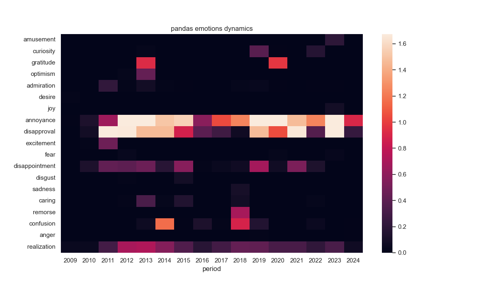
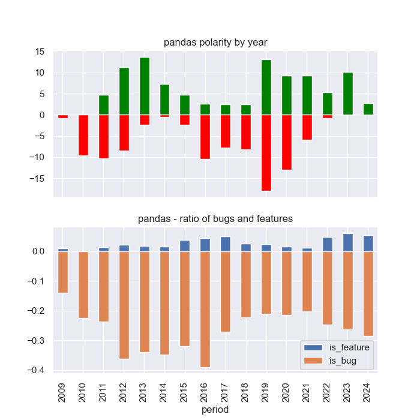
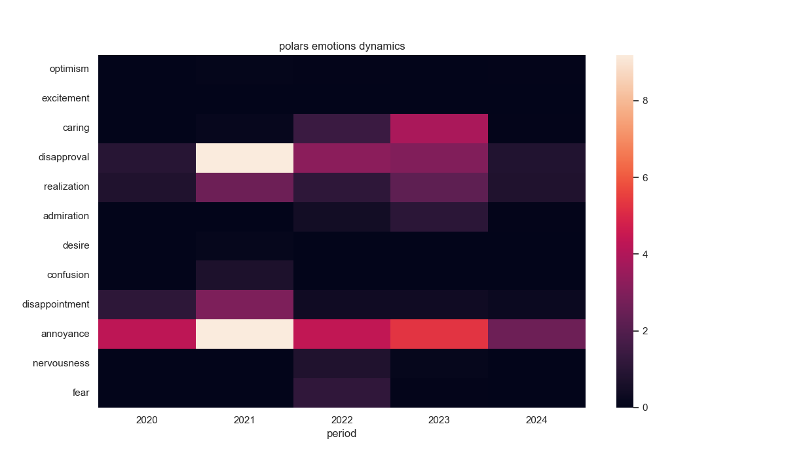
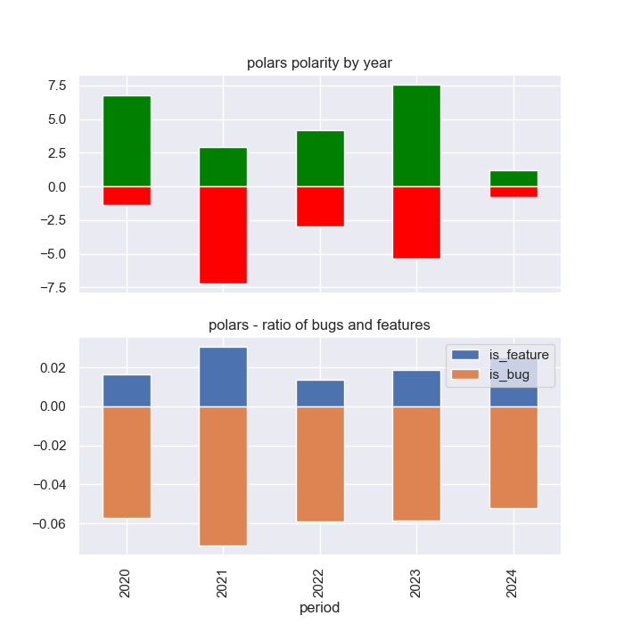

# NLP notebook for git log analysis 

1. Makes semantic analysis of the `git commit` messages
2. Resulting dataset contains polarity, subjectivity and emotional score for every commit
3. This might provide some insights about project / product 'healthness' and its phase
4. Dynamic of dev's emotions might have interesting patterns

Check it out 
    

